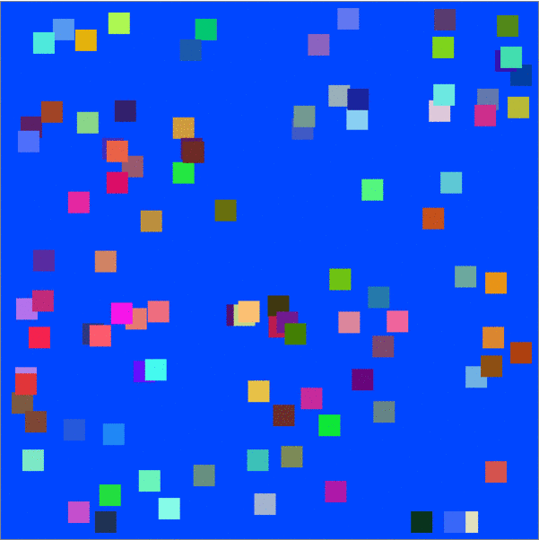

# Natural-selection-simulator

Simulating natural selection in your browser.

## Summary

This game is simulating natural selection. Firstly, we have entities. These are the "living creatures" that are trying to adapt to their environment. The environment is the background color. The closer the entity's color to the background color, the bigger biological advantage they have. For example, a red entity has far better chance to survive in an orange background than a blue entity. The entities that survive, clone themselves with a chance of mutation, that is defined by the user.
## Background color

The user has the ability to define the background color, the environment that the entities are trying to survive in.
## Mutation Possibility

The user has also the ability to define the possibility of a mutation to happen during the cloning of each entity
## Mutation Change Rate

This setting defines how higher or lower the color (rgb) can get.
## Initial Entities Number

This setting defines the initial number of entities that randomly created.

## Entities killed every generation

This percentage defines the percentage of the least adapted entities killed every generation. For example, if the user sets this to 30, and there are 100 entities, after a generation, there will be 70 entities, which will of course clone themselves.

The user is also given the ability to pass many generations once. 
